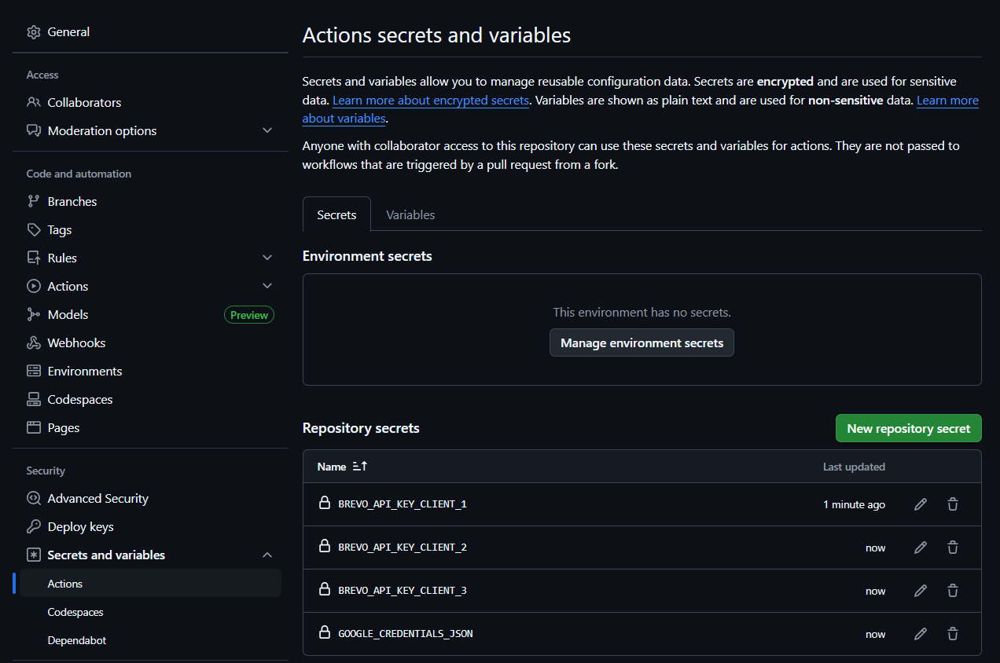
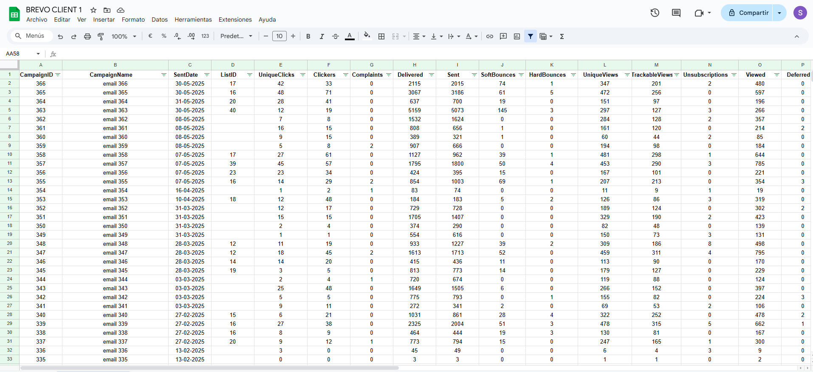
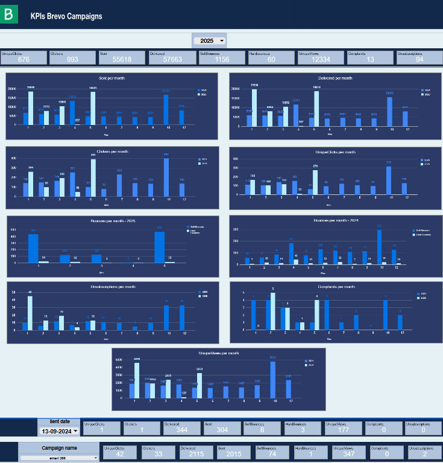
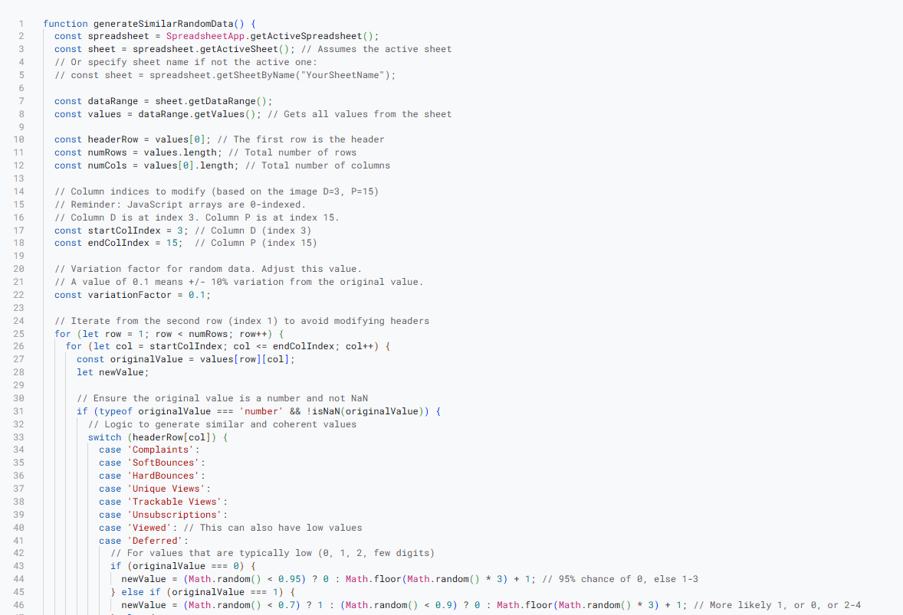

# 📊 Brevo Email Campaign Dashboard with Google Sheets & Python 🐍

  
  
  
  

---

## 📝 Project Overview

This repository demonstrates how to create **interactive dashboards in Google Sheets** using data extracted from Brevo email campaigns. It provides **Python code** that leverages the Brevo API to retrieve email Key Performance Indicators (KPIs) and then sends them to a Google Sheet. The entire data pipeline is **automated daily** thanks to a GitHub workflow, offering a practical solution for marketing and sales teams to monitor campaign performance daily.

---

## ✨ Key Features

This project outlines the construction of a robust system for automated email campaign monitoring, encompassing the following:

* **Interactive Chart Dashboards in Google Sheets:** Generates dynamic and user-friendly visualizations within Google Sheets, enabling quick analysis of email campaign results.
* **Brevo API Integration:** The system is built upon data from email campaigns sent via [Brevo](https://www.brevo.com/), a versatile platform for creating and managing marketing and sales campaigns through conversations, messages, and API.
* **Python-based KPI Extraction:** The repository includes **Python scripts** specifically designed to make calls to the Brevo API, fetching the most relevant KPIs from your email campaigns.
* **Automated Export to Google Sheets:** The extracted data is automatically and systematically sent to a designated Google Sheet, serving as the primary data source for your dashboards.
* **Daily Automated Execution with GitHub Actions:** The execution of these Python scripts is **automated daily** through a configured GitHub Actions workflow, ensuring your data and dashboards are consistently up-to-date without manual intervention.

---

## 🛠️ Repository Structure

All necessary code to replicate this project is included directly in the root of this repository:

* **Python Scripts:**
    This repository contains **three Python scripts**, each slightly modified from a common base to cater to the specific API requirements of different Brevo clients.
    * `brevo_client_1.py` 
    * `brevo_client_2.py` 
    * `brevo_client_3.py` 
   
* **Google Apps Script:**
    * `appsscript.js`: Contains the complete Google Apps Script code used for data anonymization within Google Sheets.
   
* **GitHub Workflow:**
    * `.github/workflows/daily_brevo_update.yml`: Here you will find the configuration file for the GitHub Actions workflow that automates the daily execution of the Python scripts.

---

## 🔒 Managing Secrets

For secure authentication with the Brevo API and Google Sheets, sensitive credentials (like API keys and service account keys) are stored as **GitHub Secrets**. These secrets are never exposed in the code or logs, ensuring your sensitive information remains secure.

* **Location of GitHub Secrets:** You can find and manage these secrets in your repository settings:
    `Repository > Settings > Secrets and variables > Actions`

    

---

## 📊 Data and Dashboards

For this project, the structure of both the dataset and the dashboard is based on a **real client**, providing an authentic insight into how marketing data is managed.

However, to ensure privacy and maintain confidentiality, **the actual data has been completely modified and anonymized**. This was achieved using a **Google Apps Script code** that alters the data randomly while preserving the coherence and general characteristics of the original values (e.g., ensuring that metrics like 'Complaints' remain low if their original value was low).

* **Screenshot of the Anonymized Dataset (Example of modified data):**
    
* **Screenshot of the Interactive Dashboard:**
    
* **Screenshot of the Google Apps Script code used for data modification:**
    

---

## 🚀 Getting Started (Coming Soon / Reproduction Instructions)

*(Here you can add future sections with detailed instructions on how to set up the environment, obtain Brevo API credentials, configure Google Sheets, and deploy the GitHub Actions workflow. If you don't want to add it now, you can remove this section or keep it as a placeholder.)*

---

## 🤝 Contributions

Contributions are welcome! If you have suggestions, improvements, or find any bugs, feel free to open an "issue" or submit a "pull request."

---

## 📧 Contact

* Samuel Caballero Lopez - https://github.com/samuelcaballerolopez
* samuelcablop@gmail.com
* www.linkedin.com/in/samuel-caballero-lopez
